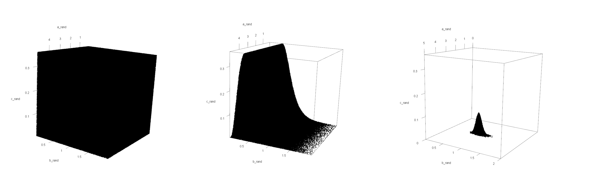
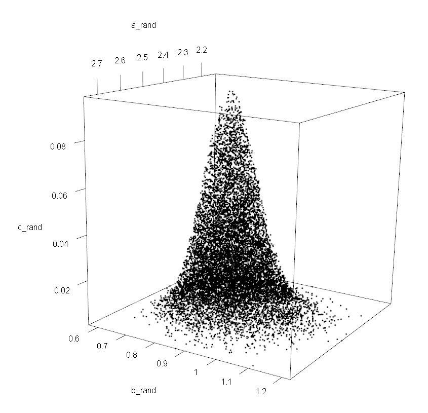

```{r setup, include=FALSE}
knitr::opts_chunk$set(echo = TRUE)
```

## Introduction

In this report we will be investigating the problem of estimating the location of a ship out to sea based on some simulated data of flashes of light from the ship recorded on the coast line. The boat is described as being some position alpha along a coastline and some distance beta out to sea. Alpha is assumed to be uniformly distributed between 0 and 5 and beta is assumed to be gamma distributed with shape parameter 4 and scale parameter 8. We will be exploring the likelihood function for the position of the ship, finding its maximum, applying an acceptance-rejection algorithm to sample from the posterior distribution, and performing monte-carlo integration to estimate probabilities based on the derived posterior distribution. 

## The Likelihood Function

In this section we will describe the given likelihood function derived from 200 points of simulated data and generate relevant plots thereof. 

```{r, echo=F}
library(openxlsx)

dat = read.xlsx("RandomData2022.xlsx")

xk = dat$ptrjos017

loglike <-function(alpha, beta, xk=xk){
  #alpha - position along the shoreline
  #beta - position out to sea
  #xk - the data

  logl<-length(xk)*(log(beta)-log(atan(alpha/beta)+atan((5-alpha)/beta))) - sum(log(beta^2+ (xk-alpha)^2))
  return( (logl) )
}

likel <-function(alpha, beta, xk=xk){
  #alpha - position along the shoreline
  #beta - position out to sea
  #xk - the data

  logl<-length(xk)*(log(beta)-log(atan(alpha/beta)+atan((5-alpha)/beta))) - sum(log(beta^2+ (xk-alpha)^2))
  return( exp(logl) )
}


loglike.vec<-Vectorize(FUN=loglike,
                           vectorize.args = c("alpha", "beta"))
likel.vec<-Vectorize(FUN=likel,
                           vectorize.args = c("alpha", "beta"))


```
```{r, echo = F}

alpha_range<-seq(from=0, to=5, length = 100 )
beta_range<- seq(from=0.1, to=5, length = 100 )
z<-outer(X=alpha_range, Y=beta_range,
         FUN="loglike.vec", xk=xk)
contour(alpha_range, beta_range, z, nlevels=30,
        xlab=expression(alpha),
        ylab=expression(beta),
        main="Log-likehood Contour Plot")

```

Here we generate a contour plot of log-likelihood function. We can see based on this plot that the maximum of the log likelihood function is likely to be in the region where alpha is between 2 and 3 and beta is between 0.5 and 1.5. For interest, we construct a contour plot of the (original) likelihood function in this region:

```{r, echo = F}

alpha_range<-seq(from=2, to=3, length = 100 )
beta_range<- seq(from=0.5, to=1.5, length = 100 )

z2<-outer(X=alpha_range, Y=beta_range,
         FUN="likel.vec", xk=xk)
contour(alpha_range, beta_range, z2, nlevels=10,
        xlab=expression(alpha),
        ylab=expression(beta),
        main="Likelihood Contour Plot")


```

Here we can see that the maximum of the likelihood function (within the search range) is around alpha = 2.4 and beta = 0.8
We will verify this by finding the MLE of the log-likelihood function. It should be noted that this is not equivalent to the best estimate of the ship's location, as we still have not incorporated any information about the prior distribution of alpha and beta. It should also be noted that the likelihood function is taking on extremely small values. We will later scale it for ease of use and interpretation.   

## Finding the MLE

In this section we will transform alpha and beta to unconstrained variables, use these transformed variables in a Newton algorithm to find the maximum of the likelihood function, and verify our result with R's "optim" function.

Alpha and beta are constrained random variables: alpha is bound to the interval [0,5] and beta is bound the the inerval [0,$\infty$). To ensure we search the entire solution space, we must first transform alpha and beta to unconstrained random variables. The logit function maps the interval [0,1] to the interval (-$\infty,\infty$). We first divide alpha by 5 and then apply the logit function, transforming it to the unconstrained random variable alpha\*. The natural logarithm function maps the interval [0,$\infty$) to the interval (-$\infty,\infty$). We take the natural logarithm of beta, transforming it to the unconstrained random variable beta\*. 


After applying the transformation, we apply a Newton-Raphson algorithm to the log likelihood function to find its maximum. From our investigation of the contour plot, we know the MLE is likely to be around alpha = 2.4, beta = 0.8. We'll take alpha = 2 and beta = 1 as a starting point to ensure we do not miss a solution. Applying our transformation to (2,1), we begin our search at alpha* = -0.4 and beta* = 0. The Newton Algorithm returns the following solution: 


```{r, echo = F,message=F}

require(boot)
require(numDeriv)

#Log-Likelihood function set up for MLE - takes a vector as an argument and returns negative likelihood value for minimisation 

logl<-function(ab, xk){

  alpha = ab[1]
  beta = ab[2]
  
  logl<-length(xk)*(log(beta)-log(atan(alpha/beta)+atan((5-alpha)/beta))) - sum(log(beta^2+ (xk-alpha)^2))
  return(-logl)
}

con_to_uncon <- function(vec){
  
  #performs a logit transformation on alpha and a log transformation on beta 

  c(logit(vec[1]/5),log(vec[2]))
  
}

uncon_to_con <- function(vec){

  #reverses the above transformation 
    
  c(5*inv.logit(vec[1]),exp(vec[2]))
  
}


loglpos <- function(ab, xk){
  #log likelihood of unconstrained alpha, beta - first transforms them back to constrained variables then evaluates 
  
  logl(uncon_to_con(ab),xk)
  
}


gradlogl <- function(x,xk){
  #calculate the gradient at location x
  
  matrix(grad(func=loglpos, x=x,xk=xk), ncol=1)
}

hesslogl <- function(x, xk){
  #calculate the hessian at location x
  #matrix of 2nd derivatives
  
  hessian(func=loglpos, x=x,xk=xk)
}

#gradlogl(logit(optim1$par/5),xk=xk) test if functions work using optim paramters
#(logit(optim1$par/5),xk=xk) 

newton <- function(x,xk, tol){

  pars <- matrix(x, ncol=1)
  error <- 1
  
  while(error > 0.000001){
    pars_old <- pars
    
    hess <- hesslogl(c(pars),xk=xk)
    pars <- pars - solve(hess)%*%gradlogl(c(pars), xk=xk)
    
    pars_new <- pars
    error <- sum(abs(pars_new - pars_old))
  }  
  
  return(pars)
}

#con_to_uncon(c(2,1))

npar = newton(x=c(-0.4,0),xk=xk , tol=0.0001) #Find optimal (unconstrained) parameters using Newton function

opt_pars = uncon_to_con(npar)
names(opt_pars) = c("alpha","beta")

knitr::kable(opt_pars,col.names = "MLE") #transform back to constrained parameters 
```

We perform the same optimisation using R's "optim" function, returning the following result:

```{r, echo = F}
#Find MLE using optim

optim1 <- optim(par=c(2.5, 0.8), 
                fn = logl,
                method = "L-BFGS-B",
                xk=xk,
                lower=rep(0.01,2),
                upper=c(5,2))

optim_pars = optim1$par #Optimal parameters to be compared to the Newton result 
names(optim_pars) = c("alpha","beta")

knitr::kable(optim_pars,col.names = "MLE") 

```
As we can see, we get a nearly identical result, suggesting our Newton algorithm has worked as intended. Minor discrepancies can be explained by the tolerance level in our Newton algorithm, which was arbitrarily set to perform optimisation up to 5 decimal places. 


## Acceptance-Rejection Sampling 


In this section, we will use the acceptance rejection algorithm (AR) to sample from $\pi(\alpha,\beta|x)$ (the scaled posterior distribution function). We will be using $h(\alpha, \beta)$ = $\pi(\alpha)\pi(\beta)$ as a candidate function. 

From our prior assumptions, we know that alpha is uniformly distributed over the interval (0,5). $\pi(\alpha)$ is therefore given as 1/(5-0) = 0.2. We have assumed that $\beta \sim \Gamma(4,8)$. We can therefore find $\pi(\beta)$ using R's dgamma function (i.e. $\pi(\beta)$ = dgamma($\beta$,4,8)). Therefore, $h(\alpha, \beta)$ = $\pi(\alpha)\pi(\beta)$ =  0.2*dgamma($\beta$,4,8)

Assuming $\alpha$ is independent of $\beta$, $\pi(\alpha,\beta)=\pi(\alpha)\pi(\beta)$. We can therefore find $\pi(\alpha,\beta)$ in R as $\pi(\alpha,\beta)$ = 0.2*dgamma($\beta$,4,8). $\pi(\alpha,\beta)$ is therefore the same function as the candidate function, $h(\alpha, \beta)$. It should be noted here that $\pi(\alpha,\beta)$ is actually only a function of $\beta$, as $\pi(\alpha)$ is constant over its domain. Graphs of $\pi(\alpha)$, $\pi(\beta)$, and $\pi(\alpha,\beta)$ have been included as an appendix.


```{r, echo = F}


pi_alpha <- function(alpha){
  
  return(0.2)
}

pi_beta <- function(beta){
  
  return(dgamma(beta,4,8))
  
  #(x^(a-1)*exp(-b*x)*b^a)/gamma(a)
  
}


pi_ab <- function(alpha,beta){ 
 
  pi_alpha(alpha)*pi_beta(beta)
  
  #Actually only a function of beta, but keeping alpha as a dummy parameter for notational consistency 

}

pi_ab.vec<-Vectorize(FUN=pi_ab,
                      vectorize.args = c("alpha", "beta"))


slike <-function(alpha, beta, xk){
  

  logl<-length(xk)*(log(beta)-log(atan(alpha/beta)+atan((5-alpha)/beta))) - sum(log(beta^2+ (xk-alpha)^2))
  return( exp(logl)/1.021015e-117 )
}


pi_abx <- function(alpha,beta,xk){
  
  
  slike(alpha,beta,xk)*pi_ab(alpha,beta)
  
}

pi_abx.vec<-Vectorize(FUN=pi_abx,
                           vectorize.args = c("alpha", "beta"))


#z1<-outer(X=alpha_range, Y=beta_range,
         #FUN="pi_abx.vec", xk=xk)
#contour(alpha_range, beta_range, z1, nlevels=20,
        #xlab=expression(alpha),
        #ylab=expression(beta),
        #main="",ylim=c(-1,2))


#Posterior for MLE

log_pi_abx <- function(ab,xk){
  
  alpha = ab[1]
  beta = ab[2]
  
  logl<-length(xk)*(log(beta)-log(atan(alpha/beta)+atan((5-alpha)/beta))) - sum(log(beta^2+ (xk-alpha)^2))
  -log(exp(logl)*pi_ab(alpha,beta))
  
  
}


```


To begin, we must first determine the range of values our candidate function can take on. Because our candidate function $\sim0.2*\Gamma(4,8)$, we know its mode (i.e. maximum) is equal to (4-1)/8) = 3/8, which means the function ranges between 0 and 0.2*dgamma(3/8,4,8) = 0.35847 We have already assumed that the domain of the function in terms of alpha is between 0 and 5. In order to perform acceptance rejection sampling, we will need to restrict the domain in terms of beta to a manageable interval. From our inspection of the likelihood function and from what we know about the gamma distribution, it is highly unlikely even for a very large simulation that our algorithm will accept many points past beta = 2. Even this is generous - my preliminary application of the algorithm to 10 million points accepted none greater than beta = 1.2  

We now have a region to sample points from - drawing a box in 3-space with:

\begin{center}

0 < $\alpha$ < 5

0 < $\beta$ < 2

0 < $h(\alpha, \beta)$ < 0.35847

\end{center}

\newpage

```{r, echo=FALSE, fig.cap="Acceptance-Rejection visulisation (3 panels)", out.width = '100%'}

```


We generate 10 million points within this box. These points have been plotted in three dimensions in the first panel of in figure 1. The next step in our algorithm is to keep only the points that fall beneath the candidate function. These points have been plotted in the second panel of figure 1. The third step is to keep of those points that fall under the posterior distribution. These points have been plotted in the third panel of figure 1. It should be noted that the posterior distribution function has been scaled here. As previously mentioned, the likelihood function returns very small values. The likelihood function has been scaled here such that its peak is 1 unit high. This ensures that the posterior distribution fits perfectly under the candidate function. Traditionally, we scale the candidate function and not the function we are sampling from, but in this case it gives the exact same results in terms of alpha and beta, and the sampled points can be scaled however we want after the fact. If we wanted a true reflection of the posterior function, we should scale them such that the volume under the surface of the function integrates to 1, but for our purposes this is unnecessary as the results for alpha and beta hold regardless of the scale of the posterior function.   

```{r, echo = F, eval=F}

#NB! THIS CODE WILL TAKE LONG TO RUN - 10 MILLION IS A LOT OF POINTS
#I have saved the resulting data frames in "samples.RData" - use load() in the following chunk if you'd like to avoid generating them yourself 

library(rgl)

pi_ab(0,3/8)

nsim = 10000000

#Generate 10M random samples in a (0,5), (0,2), (0, dgamma(3/8)) box 

a_rand = runif(nsim,0,5)
b_rand = runif(nsim,0,2)
c_rand = runif(nsim,0,pi_ab(0,3/8))

samp = cbind(a_rand,b_rand,c_rand)

plot3d(samp)

#keep points that fall under the candidate distribution (pi_ab(alpha, beta) = pie_alpha(alpha)*pi_beta(beta)

keep <- function(abc){
  
  pi_ab(abc[1],abc[2])>=abc[3]
    
}

absamp = samp[apply(samp,1,keep),]
plot3d(absamp)

#of those points, keep ones which fall under the posterior distribution 

keep2 <- function(abc){
  
  pi_abx(abc[1],abc[2],xk)>=abc[3]
  
}


abxsamp = absamp[apply(absamp,1,keep2),]
plot3d(abxsamp)

plot3d(abxsamp,xlim =c(0,5),ylim=c(0,2),zlim=c(0,pi_ab(0,3/8)))


```

A closer look at the scaled posterior has been included in the appendix. We can now use the sampled points to answer questions about the location of the boat. Of 10 million initial sample points, 12474 were ultimately accepted (the acceptance rate could be improved by refining the interval ranges or by specifying a more neatly fitting candidate function). The alpha and beta values of these points have been plotted on the following histograms:


```{r, echo = F,message=F,results='hide',out.height="300px"}

load("samples.RData")

par(mfrow=c(1,2))

hist(abxsamp[,1],breaks = 40,xlab = expression(alpha),main ="Histogram of sampled alphas")
hist(abxsamp[,2],breaks = 40,xlab = expression(beta),main ="Histogram of sampled betas" )

dev.off()


```

From these histograms we observe that the modal value for alpha was around 2.42 and the modal value for beta was aroundd 0.82. Using optim to estimate of the mode of the posterior distribution yields the following results:


```{r, echo = F}

optim2 <- optim(par=c(2.5, 0.8), 
                fn = log_pi_abx,
                method = "L-BFGS-B",
                xk=xk,
                lower=rep(0.01,2),
                upper=c(5,2))

optim2_pars = optim2$par #Optimal parameters to be compared to the Newton result 
names(optim2_pars) = c("alpha","beta")

knitr::kable(optim2_pars,col.names = "MLE") 

```

This verifies the result of our acceptance rejection sampling algorithm, which found similar values for the mode of the function in terms of alpha and beta  

```{r, echo = F,results='hide'}
nrow(abxsamp[abxsamp[,2]>0.75,])/nrow(abxsamp)

#nrow(abxsamp[abxsamp[,1]>2.4&abxsamp[,1]<2.6,])/nrow(abxsamp) 

corr(abxsamp[,1:2])

#lm(abxsamp[,2]~abxsamp[,1])
#plot(abxsamp[,1:2],pch=1,cex=0.5)
#abline(0.6579,0.0754,col='red')

```

Of our 12474 accepted points, 10568 (84.7\%) had beta values greater than 0.75 - suggesting that Pr(beta > 0.75) is approximately 0.847

The correlation coefficient between the alpha and beta values of our sample points was found to be 0.071, suggesting weak or no correlation. This is exactly what we'd expect given our assumption that alpha and beta are independently distributed. 

\newpage

## Monte Carlo Integration 

In this section, we use Monte Carlo methods to estimate Pr$(2.4 < \alpha <2.6)$, for a fixed value of $\beta$ = 0.8
We begin by finding the area under the scaled posterior function (univariate in terms of alpha). The curve integrates to 0.01965. We scale the posterior function by the inverse of this value so that it will integrate to one and therefore be a true density function. We plot the curve of this univariate posterior distribution and shade the area which we mean to find the area of in red. 

```{r, echo = F}

s_pi_abx <- function(alpha,xk){
  
  beta = 0.8
  
  slike(alpha,beta,xk)*pi_ab(alpha,beta)
  
  
}


s_pi_abx.vec<-Vectorize(FUN=s_pi_abx,
                      vectorize.args = c("alpha"))

const<-integrate(s_pi_abx.vec, lower=-Inf, upper=Inf,xk=xk)
#const$value

```

```{r, echo = F,fig.cap = "Probability density function of correctly scaled posterior distribution for beta = 0.8"}
ar = seq(2.4,2.6,length.out = 10000)

y = s_pi_abx.vec(ar,xk)/const$value

curve(s_pi_abx.vec(x,xk)/const$value,from=2,to=3,xlab = expression(alpha),ylab = "", main="Posterior Density")
polygon(c(ar[ar>2.4], 2.6, 2.4), c(y[ar>2.4], 0, 0), col="pink")
#points(ar,s_pi_abx.vec(ar,xk))


```


```{r, echo = F, results='hide'}

(sum(s_pi_abx.vec(ar,xk)/const$value)/10000)*(2.6-2.4)

integrate(s_pi_abx.vec,lower=2.4,upper=2.6,xk=xk)$value/const$value

```

We then randomly generate 10000 values uniformly distributed between 2.4 and 2.6 and parse them to the posterior function. We store the results and take their mean. We then multiply this value by the length of the interval to approximate the integral of the function from 2.4 to 2.6. This returns the value 0.5973183, implying that, for $\beta = 0.8$, Pr$(2.4 < \alpha <2.6)$ is approximately 59.73\%

We verify this answer by performing numerical integration using R's integrate function. This returns the value 0.5973263, which matches our answer to 4 decimal places. A greater sample size would improve the accuracy of this result. 

## Conclusion

The most obvious takeaway from the various exercises performed here is that, based on the given data, the boat was estimated to be located at alpha = 2.42 and beta = 0.82 We came to this conclusion based on both numerical methods such as optimisation of the posterior function and on monte carlo methods such as the stated acceptance rejection algorithm. 

\newpage

\begin{thebibliography}{9}


\bibitem{Data}
A. Clark
\textit{Newton-Raphson Alogrithms}
R Code, 2022

A. Clark
\textit{Simulated location values}
Data, 2022

\bibitem{R},
R Core Team
\textit{R: A Language and Environment for Statistical Computing},
R Foundation for Statistical Computing,Vienna, Austria, 2021, https://www.R-project.org/
  
\end{thebibliography}


## Appendix

```{r, echo = F}

pi_alpha.vec = Vectorize(pi_alpha,"alpha")
pi_beta.vec = Vectorize(pi_beta,"beta")

#Marginal Priors

curve(pi_alpha.vec,from=0,to=5, main=expression(pi(alpha)),ylab="",xlab=expression(alpha))
curve(pi_beta.vec,from=0,to=2,main=expression(pi(beta)),ylab="",xlab=expression(beta))


```

```{r, echo=FALSE, fig.cap="12474 posterior samples (arbitrary scale)", out.width = '100%'}

#Joint Posterior


```

